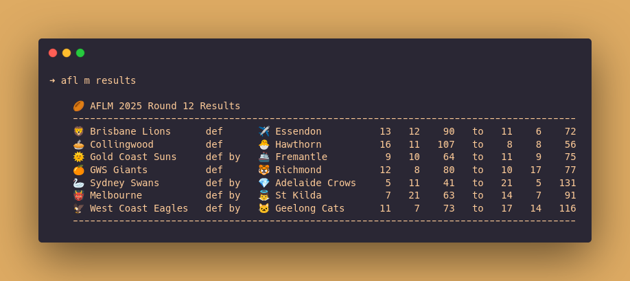

# Faster footy scores

*Where to view this piece: [on GitHub](https://github.com/jackhiggins458/afl_cli).*

---

A command line interface for viewing AFLW and AFLM data, written in R. Source code and documentation can be found in the repository linked above. Below, I'd like to walk you through my motivation for creating this tool, as well as a rough outline of how I approached the process of writing it.


## Motivation

As a Melburnian, it's hard to get away from the AFL. While I haven't been following footy very closely over the past few years, I do like to keep track of what's going on. Normally, the easiest way to do this would be to check the scores online. However, the ofiicial AFL/AFLW website can be painfully slow to load, and it's chock full of advertisements and trackers. 

As a casual fan, I wanted a simple way to quickly check fixtures, ladders, results and live scores. (I also wanted to learn more about simple command line tools in R, so this seemed like a nice project to test this!)

## Development process

### Selecting a data source

First thing first, I needed to find a data source. Searching online, I found the [Squiggle API](https://api.squiggle.com.au/), which offers access to basic data on AFL games. It seems to be a simple, well documented and well maintained API, so I decided it would be a suitable starting point.

---

### Choosing a language

I then had to decide what language to use. I started out writing a bash script, but it quickly became unwieldy as I continued to add more features. I then decided to move over to R, not because it's a particularly good language for writing command line tools, but because I'm already familiar with it, and learning more about how to develop command line interfaces using R would be useful.

---

### Finding [`fitzRoy`](https://github.com/jimmyday12/fitzRoy) and switching APIs

I got to work in R, starting out by using the [`httr2`](https://httr2.r-lib.org/) package to query the Squiggle API directly, before recalling the first law of R: if you're trying to do something, someone else has already published a package to help you do that[^1]. It didn't take long to find [`fitzRoy`](https://github.com/jimmyday12/fitzRoy), which is a great little package for accessing a few different AFL data sources, including the Squiggle API.

Shortly afterwards, I realised that the Squiggle API didn't provide data for the women's competition (AFLW). Luckily, [`fitzRoy`](https://github.com/jimmyday12/fitzRoy) provides access to other APIs, including an [official AFL API](https://aflapi.afl.com.au) (which, strangely, I couldn't find any details about online?). The official AFL API does provide data for the AFLW, so I began using it in place of Squiggle[^2].

---

### Caching calls using [`memoise`](https://memoise.r-lib.org/) and [`cachem`](https://cachem.r-lib.org/)

During the early stages of development, I was doing a bunch of iteration and testing, and so I was hitting the API frequently. I knew that I wanted to minimise the number of API calls in the finished product by caching queries locally, so I turned to implementing caching before continuing feature development. Poking around online, I came across the [`memoise`](https://memoise.r-lib.org/) and [`cachem`](https://cachem.r-lib.org/) packages, that can be used to cache function call outputs and manage on-disk caches respectively. I used these packages to cache `fitRoy` function calls, using a cache that expired quickly for data that would need to be updated frequently (e.g. results during a weekend), and a separate cache for data that wouldn't be updated (e.g. viewing ladders from past years).

---

### Parsing command line arguments with [`docopt`](https://github.com/docopt/docopt.R)

Now that I had implemented some basic data fetching and caching, I turned to making the R script usable directly as a command from the terminal. I've used quite a few command line tools, but I'd never written one before, so I did a little research first. 

[This series of blog posts](https://blog.sellorm.com/2017/12/18/learn-to-write-command-line-utilities-in-r/) by Mark Sellors was a great, simple introduction to writing command line utilities, and is where I came across the  [`docopt`](https://github.com/docopt/docopt.R) package.  [`docopt`](https://github.com/docopt/docopt.R) makes it easy to both define the use of a tool, and to parse arguments passed into it. You define what arguments can be passed into the tool using a string (that reads like the help message, and is returned when the `-h` flag is used) and then parse the arguments by passing the string into the `doctopt` function. In practice, this looks like:

```R
doc <- 'A cli for viewing AFL(W/M) data

Usage:
  afl (w|m) ladder [--season <year>]
  afl (w|m) fixture [--season <year>] [--round <round>]
  afl (w|m) results [--season <year>] [--round <round>]
  afl (w|m) live

Options:
  -h --help              Show help.
  -s --season <year>     Season [default: {current_year}].
  -r --round <round>     Round of season [default: {current_round}].

' |> glue::glue()

args <- docopt::docopt(doc)
```


Neat right? There are a variety of similar tools to choose from, and docopt isn't without its quirks[^3], but the simplicity of defining the interface using a help string was too convenient to pass up.

I also came across [this post](https://blog.djnavarro.net/posts/2021-04-18_pretty-little-clis/) by Danielle Navarro, introducing the [`cli`](https://cli.r-lib.org/) package for generating pretty command line outputs. The post provides some really helpful examples of how to use [`cli`](https://cli.r-lib.org/), and I recommend checking it out if you're ever developing something in R that interacts with the command line. However, the package doesn't currently support multiple line outputs (as described in this [issue](https://github.com/r-lib/cli/issues/229)), which I needed in the form of outputting tables, so I didn't end up using it. Instead, I used [`knitr::kable()`](https://bookdown.org/yihui/rmarkdown-cookbook/kable.html), which does a great job at generating plaintext tables.

---

### Boosting reproducibility with [`renv`](https://rstudio.github.io/renv/index.html)

Once I had reached the stage where the tool could actually produce useful outputs, I wanted to get it into a state that it could, in theory[^4], be installed and used by others without too much hassle. As described in the [getting started documentation](https://rstudio.github.io/renv/articles/renv.html), `renv` creates an isolated environment for installing and managing R packages, making it easier for others to get your R code running on their machine. If you're familiar with Python's `venv`, the `renv` package serves a similar purpose[^5].

Upon opening `afl.R` in R, `renv` will bootstrap itself, and then `renv::restore()` can be used to install all necessary dependencies in an isolated environment. 

```R
# Bootstrapping renv 1.1.4 ---------------------------
# - Downloading renv ... OK
# - Installing renv  ... OK

# - Project '~/afl_cli' loaded. [renv 1.1.4]
# - None of the packages recorded in the lockfile are currently installed.
# - Use `renv::restore()` to restore the project library.

renv::restore()
```

---

### Visualising use with Carbon

Finally, I wanted to be able to show what the tool can do. While it is a text based tool, I like including visual representations in documentation, as they can be quite eye-catching!

I initially tried using terminal recorders [charm_VHS](https://github.com/charmbracelet/vhs) and [asciinema](https://github.com/asciinema/asciinema), but I ran into a few issues with each that I didn't have the time to resolve (I'd already spent far too long mucking around with annoying emoji/unicode font compatibility issues). 

Instead, I used [Carbon](https://carbon.now.sh/) to create nice, high-resolution images of the tool in action:




[^1]: Okay, this isn't really a "law". Nevertheless, I'm always surprised by how often it holds, and it's something I very much appreciate about the R community.
[^2]: The official AFL API isn't without its own limitations. For example, it doesn't provide access to live scores, and it only seems to report data back to 2012. Going forward, I'll use `fitzRoy` to pull data from multiple APIs.
[^3]:  For example, it doesn't support asserting arguments be a certain type. All arguments are read in as logicals or strings, and need to be manually converted to numerics. It also produces some [confusing error messages](https://github.com/docopt/docopt.R/issues/49) when arguments are missing or unsupported.
[^4]:In practice, I'm not sure there's any audience for this, but who knows!
[^5]: They're not quite like for like though, one key difference being that `venv` can specify a Python interpreter, but `renv` cannot be used to control the version of R used.