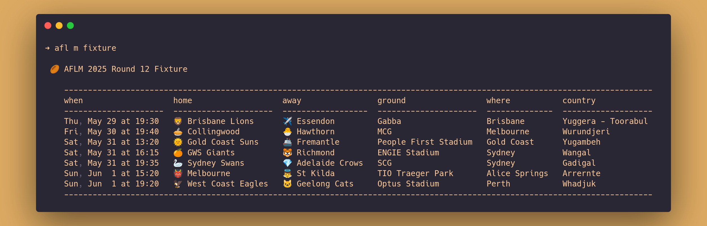

# Faster footy scores

*Where to view this piece: [on GitHub](https://github.com/jackhiggins458/afl_cli).*

---

A CLI interface for viewing AFLW and AFLM scores, written in R. Source code and documentation can be found in the repository linked above. Below, I'll outline the motivation and development process.


## Motivation

As a Melburnian, it's hard to get away from the AFL. While I haven't been following closely over the past few years, I do like being able to check in from time to time. 

However, if you've ever used the official AFL website, you might have noticed that it can be painfully slow to load. It's also chock full of advertisements and trackers. As a casual fan, I wanted a simple way to quickly check fixtures, ladders, results and live scores. (I also wanted to have a go at writing my own CLI tool, and this seemed like a good excuse.)

## Development process

### Selecting a data source

The first thing I needed to figure out was where I could get data from. Searching online, I found the [Squiggle API](https://api.squiggle.com.au/), which offers access to basic data on AFL games. It's a simple and well documented + maintained API, so it seemed like a great place to start.

### Choosing a language

I then had to decide what language to use. I started writing a bash script, but it quickly became unwieldy as I continued to add more features. I then decided to move over to R, not because it's a particularly good language for writing CLI tools, but because I'm already familiar with it, and learning more about how to develop CLIs using R would be useful in my data science work.

### Finding [`fitzRoy`](https://github.com/jimmyday12/fitzRoy) and switching APIs

In R, I started out using the [`httr2`](https://httr2.r-lib.org/) package to query the Squiggle API directly, before recalling the first law of R: if you're trying to do something, someone else has  already made a package to do it[^1]. It didn't take long to find [`fitzRoy`](https://github.com/jimmyday12/fitzRoy), which is a great little package for accessing a few different AFL APIs (including the Squiggle API).

Shortly afterwards, I realised that the Squiggle API didn't provide data for the women's competition (AFLW). Luckily, [`fitzRoy`](https://github.com/jimmyday12/fitzRoy) provides access to other APIs, including an [official AFL API](https://aflapi.afl.com.au) (which I couldn't find any details about online?). The official AFL API does provide data for the AFLW, so I began querying this API instead of Squiggle[^2].

### Caching calls using [`memoise`](https://memoise.r-lib.org/) and [`cachem`](https://cachem.r-lib.org/)

During the early stages of development, I was doing a bunch of iteration and testing, and so I was hitting the API a lot. I knew that I also wanted to minimise the number of API calls in the finished product by caching queries locally, so I began to research methods for caching in R. That's when I came across the [`memoise`](https://memoise.r-lib.org/) and [`cachem`](https://cachem.r-lib.org/) packages, that allow you to easily cache function call outputs and  manage caches respectively. I used each of these packages to cache calls, using a cache that expired quickly for data that would need to be updated frequently (e.g. live scores), and a separate cache for data that wouldn't be updated (e.g. viewing ladders from past years).

### Handling CLI arguments and documentation with [`docopt`](https://github.com/docopt/docopt.R)

Now that I had implemented some basic data fetching and caching, I turned to making the R script usable directly as a command from the terminal. I'd used a few CLIs before, but I'd never written one before, so I did a little research first. 

[This series of blog posts](https://blog.sellorm.com/2017/12/18/learn-to-write-command-line-utilities-in-r/) by Mark Sellors was a great, simple introduction to writing command line utilities, and is where I came across the  [`docopt`](https://github.com/docopt/docopt.R) package.  [`docopt`](https://github.com/docopt/docopt.R) makes it easy to both define a CLI and to parse it. You define the interface using a string (that reads like the help message, and is actually returned when the `-h` flag is used) and then parse the arguments by passing the string into the `doctopt` function. In practice, this looks like:

```R
doc <- 'A cli for viewing AFL(W/M) data

Usage:
  afl (w|m) ladder [--season <year>]
  afl (w|m) fixture [--season <year>] [--round <round>]
  afl (w|m) results [--season <year>] [--round <round>]
  afl (w|m) live

Options:
  -h --help              Show help.
  -s --season <year>     Season [default: {current_year}].
  -r --round <round>     Round of season [default: {current_round}].

' |> glue::glue()

args <- docopt::docopt(doc)
```


Neat right? There are a variety of similar tools to choose from, and docopt isn't without its quirks[^3], but the sheer simplicity of defining the interface using a help string was too convenient to pass up.

I also came across [this post](https://blog.djnavarro.net/posts/2021-04-18_pretty-little-clis/) by Danielle Navarro, introducing the [`cli`](https://cli.r-lib.org/) package for generating pretty CLI outputs. The post provides some really helpful examples of how to use [`cli`](https://cli.r-lib.org/), and I definitely recommend checking it out. However, I couldn't see an obvious way to use this package to print tables, so I didn't end up using it. Instead, I found that [`knitr::kable()`](https://bookdown.org/yihui/rmarkdown-cookbook/kable.html) does a great job at generating simple tables, and so I used that instead.

Finally, I wanted to be able to share what the tool can do visually. I initially tried using terminal recorders [charm_VHS](https://github.com/charmbracelet/vhs) and [asciinema](https://github.com/asciinema/asciinema), but I ran into a few issues with each that I didn't have the time to resolve (I'd already spent far too long mucking around with annoying emoji/unicode font compatibility issues). 

Instead, I used [Carbon](https://carbon.now.sh/) to create an aesthetically pleasing, high resolution images of the CLI in action:




[^1]: Okay, this isn't really a "law". Nevertheless, I'm always surprised by how often it holds, and it's something I very much appreciate about the R community.
[^2]: The official AFL API isn't without its own limitations. For example, it only seems to report data back to 2012. Going forward, I'll be using `fitzRoy` to pull on different APIs, depending on the command entered.
[^3]:  For example, it doesn't support asserting arguments be a certain type. All arguments are read in as logicals or strings, and need to be manually converted to numerics. It also produces some [confusing error messages](https://github.com/docopt/docopt.R/issues/49) when arguments are missing or unsupported.