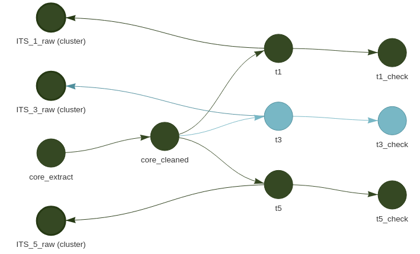

# Building reproducible data pipelines

*Where to view this piece: Unfortunately the source code isn't public, but some outputs are available [in this ABS publication](https://www.abs.gov.au/statistics/economy/international-trade/characteristics-australian-exporters/latest-release).*

---

I previously worked at the Australian Bureau of Statistics as a data scientist in the methodology division. My day to day work involved developing internal facing tools and analytical pipelines using R, and occasionally in Python. 

In one project, I was called in to assist the International Trade Statistics team in the redevelopment of their data pipelines and analytical methodology for an upcoming publication, in response to the availability of a new data source. 

In this work, I:

- Used R to develop a data pipeline that extracted, cleaned, transformed and exported the data needed for this publication. I designed the pipeline to be robust and reusable, by employing input validation, version control, unit testing and build automation (the image above is part of the dependency graph of this pipeline, generated by the build automation package [`targets`](https://books.ropensci.org/targets/) ).
- Wrote a script to generate synthetic data. The real data was sensitive in nature, and could only be accessed in a locked-down and restrictive computing environment. By using synthetic data, I was able to iterate more quickly by developing first in a less restrictive environment, before importing the finished pipeline for final testing and use on real data.
- Introduced the team to literate programming, by creating a draft publication template in R markdown, allowing them to easily test new ideas for their publication.
- Consulted with subject matter experts in the team to develop and implement a new data linkage methodology (described in the [publication's methodology report](https://www.abs.gov.au/methodologies/characteristics-australian-exporters-methodology/2019-20)), allowing the new, richer data source to be integrated into the analysis.

---
